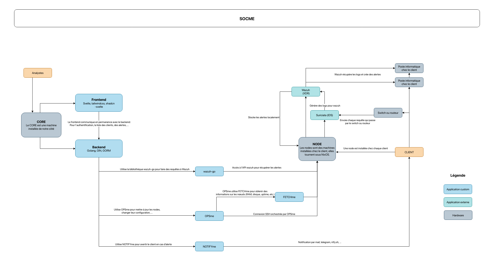
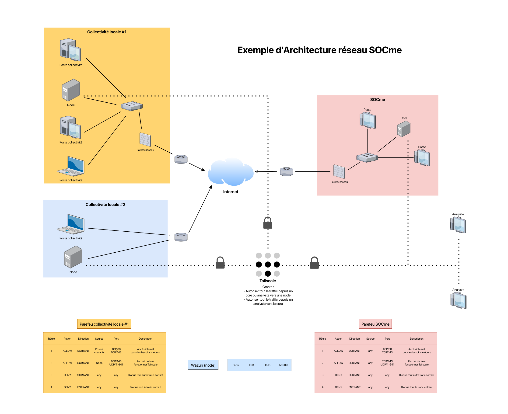

# SOCme

## Summary

### Table of Contents

### External Links

- [English version 🇬🇧](./README-en.md)
- [Frontend (FR)](https://github.com/socme-project/socme/blob/main/front/README.md)
- [Frontend (EN)](github.com/socme-project/socme/blob/main/front/README-en.md)
- [Backend (FR)](https://github.com/socme-project/socme/blob/main/back/README.md)
- [Backend (EN)](github.com/socme-project/socme/blob/main/back/README-en.md)

## Introduction

### What is a Security Operations Center (SOC)?

A **Security Operations Center (SOC)** is a centralized cybersecurity team
responsible for monitoring, detecting, analyzing, and responding to threats
in real time. It is typically composed of analysts, engineers, and
incident response experts. A SOC relies on tools such as
**SIEMs**, **EDRs**, and other detection systems.

Its main missions:

- 24/7 monitoring
- Incident detection
- Threat analysis
- Log correlation
- Threat hunting
- Simulations and post-mortems

### The project

**SOCme** is an open-source version of a SOC. The goal is to provide a
decentralized solution for monitoring networks and logs, relying
solely on open-source technologies, best practices,
reproducible configurations, and clear documentation.

## Operation

Retrieving all client logs on a single server is too expensive. SOCme
is therefore **decentralized**: each client has a **node** responsible for
local monitoring, which only sends **alerts** to a centralized **core**.

### Components

- **Core**:
  - SOCme's brain: user, client, node, notification management,
    alert visualization...
- **Node**:
  - Installed at each client, monitors network, logs, files, etc.
  - Primarily uses Wazuh & Suricata
- **Screen**:
  - Simplified display of alerts on a screen (e.g. Raspberry Pi)

The components communicate via a [Tailnet](https://tailscale.com/) network.

- Supports hardening, CI/CD
- Based on NixOS

### Applications

#### SOCme

This repository contains the main application, composed of:

- A **frontend** (Svelte) using:
  - [`sv-router`](https://sv-router.vercel.app/)
  - [`shadcn-svelte`](https://shadcn-svelte.com/)
  - [`tailwindcss`](https://tailwindcss.com/)
- A **backend** (Go) using:
  - [`gin`](https://gin-gonic.com/)
  - [`gorm`](https://gorm.io/index.html)

#### SOCme-os

[SOCme-os](https://github.com/socme-project/socme-os): NixOS configuration to
deploy the _core_ and _nodes_.

#### Wazuh-go

[wazuh-go](https://github.com/socme-project/wazuh-go): Go library to
interact with the Wazuh API.

#### Wazuh-nix

[wazuh-nix](https://github.com/socme-project/socme-os/blob/main/modules/wazuh.nix):
NixOS file to install Wazuh on machines (dashboard, manager, indexer).

#### NOTIFYme

[NOTIFYme](https://github.com/socme-project/notifyme): Go library to
send notifications via different channels.

#### FETCHme (TO DO)

[FETCHme](https://github.com/socme-project/fetchme): `pfetch` configuration
to display system information on the _nodes_.

#### OPSme

[OPSme](https://github.com/socme-project/opsme): Go library to manage a
fleet of machines via SSH.

### External dependencies

#### Wazuh

Open-source XDR for monitoring logs, files, processes... Generates
alerts based on rules. Updating rules via CI/CD is recommended.

#### Suricata

Open-source IDS for network analysis. Works via port mirroring or TAP.
Sends its alerts to Wazuh.

#### Tailscale

Mesh VPN facilitating secure connection between _nodes_ and _core_, without
port opening.

## In practice

### Client deployment

1. Create a client on the _core_ (via Tailscale) to obtain a token
2. Install the machine on the client network
3. Adapt the NixOS config (interfaces, passwords, hostname)
4. Deploy the Wazuh agent (via GPO for example)
5. Deploy Sysmon on the workstations for more visibility
6. Configure port mirroring to the Suricata interface

It's fast. Depending on the client's IS, some steps can be automated.

Then, define the alert rules with the client and configure the
notifications. Examples:

- Brute-force → mail to the admin
- Compromise → mail + call
- Specific alert → display on the client dashboard

### Operation

During the RUN phase:

- Monitoring of alerts, incidents and performance
- Updates to rules and configurations
- Analysis and response according to criticality
- Creation of new rules if necessary
- Documentation of events

## Schemas

### Application schema

### Network architecture

