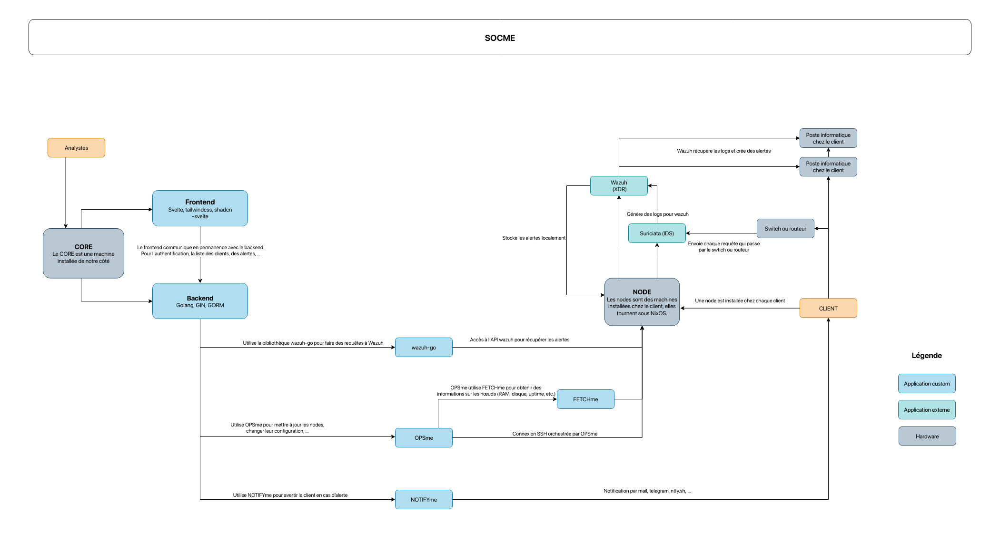
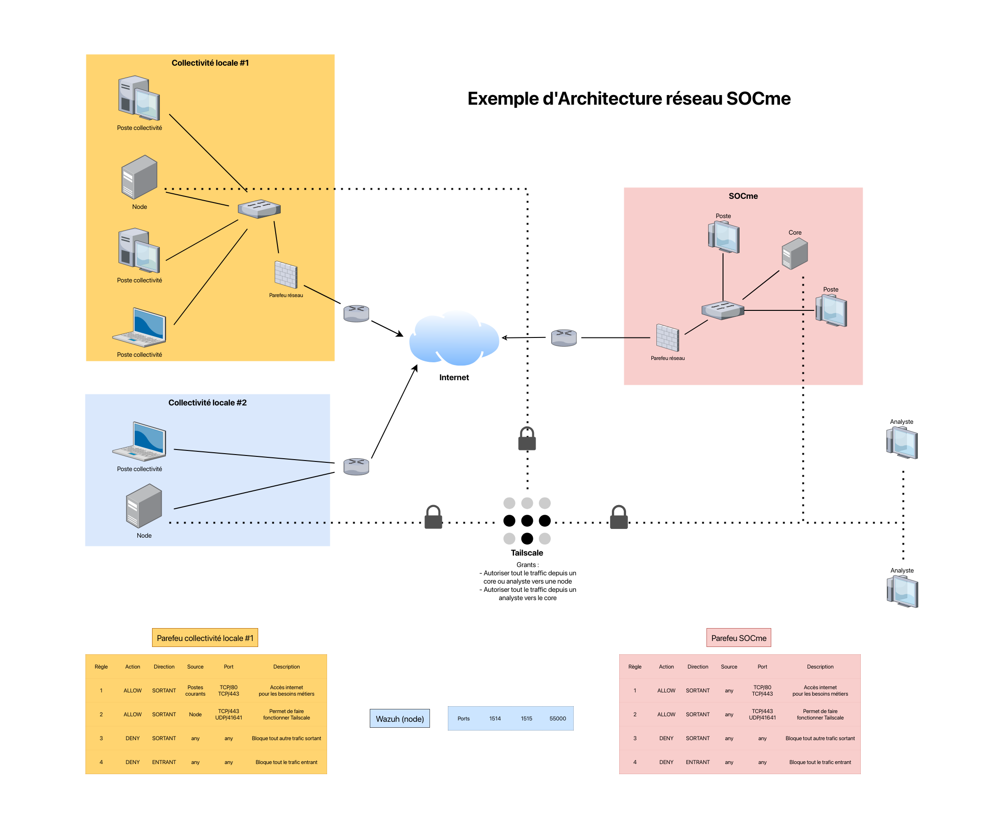

# SOCme

## Sommaire

### Table des matières

### Liens externes

- [English version 🇬🇧](./README-en.md)
- [Frontend (FR)](https://github.com/socme-project/socme/blob/main/front/README.md)
- [Frontend (EN)](github.com/socme-project/socme/blob/main/front/README-en.md)
- [Backend (FR)](github.com/socme-project/socme/blob/main/back/README.md)
- [Backend (EN)](github.com/socme-project/socme/blob/main/back/README-en.md)

## Introduction

### Qu’est-ce qu’un Security Operations Center (SOC) ?

Un **Security Operations Center (SOC)** est une équipe centralisée de
cybersécurité chargée de surveiller, détecter, analyser et répondre aux menaces
en temps réel. Il est généralement composé d’analystes, d’ingénieurs et
d’experts en réponse aux incidents. Un SOC s’appuie sur des outils comme les
**SIEM**, les **EDR**, et d’autres systèmes de détection.

Ses missions principales :

- Surveillance 24/7
- Détection d’incidents
- Analyse des menaces
- Corrélation de logs
- Threat hunting
- Simulations et post-mortems

### Le projet

**SOCme** est une version open-source d’un SOC. L’objectif est de proposer une
solution décentralisée pour surveiller les réseaux et les logs, en s’appuyant
uniquement sur des technologies open-source, des bonnes pratiques, des
configurations reproductibles, et une documentation claire.

## Fonctionnement

Récupérer tous les logs clients sur un unique serveur est trop coûteux. SOCme
est donc **décentralisé** : chaque client dispose d’un **nœud** chargé de la
surveillance locale, qui envoie uniquement les **alertes** à un **core**
centralisé.

### Composants

- **Core** :
  - Cerveau de SOCme : gestion des utilisateurs, clients, nœuds, notifications,
    visualisation des alertes...
- **Node** :
  - Installé chez chaque client, surveille réseau, logs, fichiers, etc.
  - Utilise principalement Wazuh & Suricata
- **Screen** :
  - Affichage simplifié des alertes sur un écran (ex : Raspberry Pi)

Les composants communiquent via un réseau [Tailnet](https://tailscale.com/).

- Supporte hardening, CI/CD
- Basé sur NixOS

### Applications

#### SOCme

Ce dépôt contient l’application principale, composée de :

- Un **frontend** (Svelte) utilisant :
  - [`sv-router`](https://sv-router.vercel.app/)
  - [`shadcn-svelte`](https://shadcn-svelte.com/)
  - [`tailwindcss`](https://tailwindcss.com/)
- Un **backend** (Go) utilisant :
  - [`gin`](https://gin-gonic.com/)
  - [`gorm`](https://gorm.io/index.html)

#### SOCme-os

[SOCme-os](https://github.com/socme-project/socme-os) : configuration NixOS pour
déployer le _core_ et les _nodes_.

#### Wazuh-go

[wazuh-go](https://github.com/socme-project/wazuh-go) : bibliothèque Go pour
interagir avec l’API Wazuh.

#### Wazuh-nix

[wazuh-nix](https://github.com/socme-project/socme-os/blob/main/modules/wazuh.nix) :
fichier NixOS pour installer Wazuh sur les machines (dashboard, manager, indexer).

#### NOTIFYme

[NOTIFYme](https://github.com/socme-project/notifyme) : bibliothèque Go pour
envoyer des notifications via différents canaux.

#### FETCHme

[FETCHme](https://github.com/socme-project/fetchme) : configuration `pfetch`
pour afficher des infos système sur les _nodes_.

#### OPSme

[OPSme](https://github.com/socme-project/opsme) : bibliothèque Go pour gérer une
flotte de machines via SSH.

### Dépendances externes

#### Wazuh

XDR open-source pour la surveillance des logs, fichiers, processus… Génère des
alertes basées sur des règles. Mise à jour des règles via CI/CD recommandée.

#### Suricata

IDS open-source pour l’analyse réseau. Fonctionne via port mirroring ou TAP.
Envoie ses alertes à Wazuh.

#### Tailscale

VPN mesh facilitant la connexion sécurisée entre les _nodes_ et le _core_, sans
ouverture de ports.

## En pratique

### Déploiement client

1. Créer un client sur le _core_ (via Tailscale) pour obtenir un token
2. Installer la machine sur le réseau client
3. Adapter la config NixOS (interfaces, mots de passe, hostname)
4. Déployer l’agent Wazuh (via GPO par exemple)
5. Déployer Sysmon sur les postes pour plus de visibilité
6. Configurer le port mirroring vers l’interface Suricata

C’est rapide. Selon le SI client, certaines étapes peuvent être automatisées.

Ensuite, définir les règles d’alertes avec le client et configurer les
notifications. Exemples :

- Brute-force → mail à l’admin
- Compromission → mail + appel
- Alerte spécifique → affichage sur le dashboard client

### Exploitation

Pendant la phase RUN :

- Surveillance des alertes, incidents et performances
- Mises à jour des règles et configurations
- Analyse et réponse selon criticité
- Création de nouvelles règles si nécessaire
- Documentation des événements

## Schémas

### Schéma applicatif

### Architecture réseau

